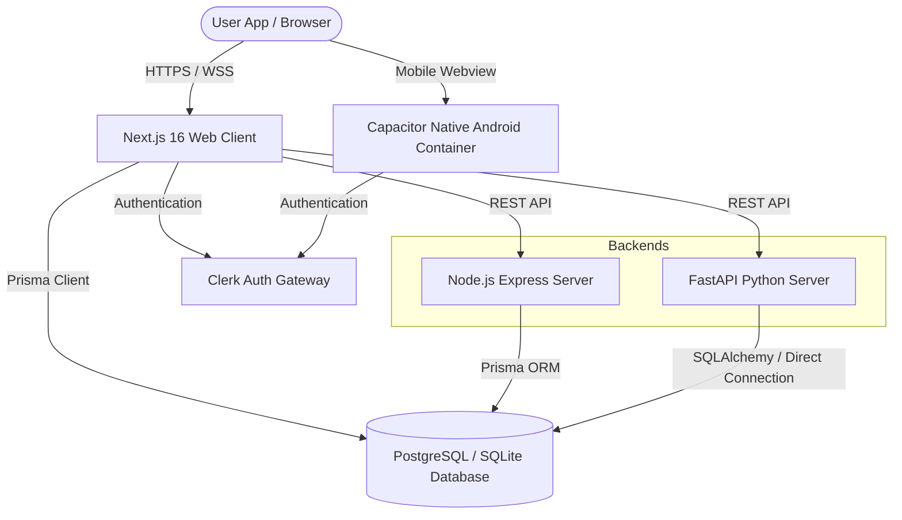

# PROJECT COMPLETION REPORT
## Delhi Public School (DPS), Damanjodi — ERP Portal
### A Unified Web & Mobile Cloud ERP Platform

---

## 1. Executive Summary
This project delivers a state-of-the-art Enterprise Resource Planning (ERP) platform customized for the Delhi Public School (DPS), Damanjodi. The platform coordinates, digitizes, and automates daily school operations, scheduling, role-based user portals, library catalogs, attendance logs, leave request pipelines, and grade marking schemes.

The platform is deployed as a responsive web client and a companion Android application. The deployment leverages a fully automated CI/CD cloud build pipeline (GitHub Actions) to compile the native Android package (`.apk`) and automatically deliver it to the production web portal for direct downloads.

---

## 2. Project Goals & Objectives
*   **Ledger Replacement**: Transition physical ledgers, spreadsheets, and manual notices into a unified database structure.
*   **Role-Enforced Workspaces**: Create customized, secure portal interfaces for Administrators, Teachers, Students, and Parents.
*   **Student Mobile Access**: Deliver a native, lightweight Android application specifically optimized and restricted to Student logins.
*   **Developer Simplicity**: Establish a developer workflow requiring zero local SDK installations by utilizing cloud-based Android builds.
*   **High Performance & Security**: Maintain fast page load speeds, secure JWT authentication via Clerk, and encrypted database connections.

---

## 3. Technical Architecture & Tech Stack



### Component Details:
*   **Frontend Client**: Next.js 16 (React 19) styled with Tailwind CSS v4, Lucide Icons, and Recharts for visual analytics. Protected routes use Next.js Middleware.
*   **Authentication**: Clerk Auth providing secure JSON Web Token (JWT) sessions, Google OAuth integration, and customized role selection screens.
*   **Database Tier**:
    *   **Development**: SQLite3 local file (`dev.db`).
    *   **Production**: PostgreSQL database hosted on Supabase (Pooler integration enabled).
    *   **ORM Layer**: Prisma ORM, utilizing an automated `prisma-prebuild.js` compiler script to dynamically switch between SQLite (development) and PostgreSQL (production) schemas at build time.
*   **API Backends**:
    *   **Node.js Server**: Express.js with TypeScript and Prisma Client.
    *   **Python Server**: FastAPI with Python 3.10+ providing high-performance, asynchronous endpoints.
*   **Mobile Wrapper**: Capacitor runtime executing 100% of the web layout codebase inside a native Android container.

---

## 4. Implementation Phase & Deliverables

### Phase 1: Database & Backend Setup
*   Configured the unified Prisma data model (`User`, `Student`, `Parent`, `Teacher`, `Attendance`, `Grade`, `Book`, `BookIssue`, `Announcement`, `LeaveRequest`).
*   Created a mock database seeder script (`prisma/seed.js`) populating SQLite with standard test users and library items.
*   Built and verified Express and FastAPI backends exposing REST APIs for dashboard metrics, attendance marking, announcements, and portal data.

### Phase 2: Next.js Web Client & Clerk Integration
*   Developed a responsive user interface with home page announcements, admissions info, and visitor contact portals.
*   Integrated Clerk sign-in and sign-up overlays.
*   Developed the custom `AuthProvider` and `/register-role` handler allowing new users to sync their profiles and select database roles.
*   Built four dashboards:
    1.  **Admin Portal**: Student/Teacher registry registries, global announcement posting, and library catalog configurations.
    2.  **Teacher Portal**: Class roll call logger, term grade entries, assignment uploads, and leave reviews.
    3.  **Student Portal**: Attendance tracker, grade progress report cards, issued library books, and personal leave applications.
    4.  **Parent Portal**: Child's attendance tracker, report card progress, and child leave application forms.

### Phase 3: Android App Setup & Student-Only Access
*   Initialized Capacitor Android configuration (`com.dps.damanjodi.erp`).
*   Developed the `AndroidRedirect` client wrapper. If accessed inside the Android application container, the app immediately redirects from the home landing page directly to `/login`.
*   Implemented client-side layout guards. If a Parent, Teacher, or Admin attempts to log in on the Android app, they are greeted with an access restriction alert and automatically logged out.
*   Modified the registration screen to hide Teacher, Parent, and Admin registration panels on Android, restricting mobile sign-up exclusively to Students.

### Phase 4: Cloud CI/CD APK Compilation (GitHub Actions)
*   Created an automated build workflow (`.github/workflows/build-android.yml`) running on Java JDK 21.
*   When code is pushed to GitHub, the workflow automatically:
    1.  Installs dependencies and prepares dummy web assets.
    2.  Syncs Capacitor configurations.
    3.  Runs the Gradle compiler toolchain to build the native Android package (`app-debug.apk`).
    4.  Copies the compiled `.apk` directly to `public/dps-student-portal.apk`.
    5.  Commits the updated APK and pushes it back to the `main` branch (with build skips to avoid loops).
*   Vercel automatically detects the push and deploys the site, making the navbar **"Android App for Students"** download button instantly serve the latest APK.

---

## 5. Local Development & Run Guidelines

### Prerequisites
*   Node.js v20+
*   Python v3.10+
*   SQLite3

### 1. Database Setup
```bash
# Copy local environment settings
cp .env.local .env

# Generate Prisma Client & Sync Database
npx prisma generate
npx prisma db push

# Seed SQLite database
node prisma/seed.js
```

### 2. Run Next.js Frontend
```bash
npm install
npm run dev
# Server runs on: http://localhost:3000
```

### 3. Run Node.js Express Backend
```bash
cd backend
npm install
npm run dev
# Server runs on: http://localhost:5000
```

### 4. Run Python FastAPI Backend (Optional)
```bash
cd backend-python
python -m venv venv
.\venv\Scripts\Activate.ps1   # (Windows)
pip install -r requirements.txt
python main.py
# Server runs on: http://localhost:5000
```

---

## 6. Verification & Results
*   **Linter Checks**: Passed Next.js and ESLint code checks with zero errors/warnings.
*   **Production Deployment**: The portal is successfully compiled, deployed, and live at **[dps-damanjodi-erp.vercel.app](https://dps-damanjodi-erp.vercel.app/)** connecting dynamically to Supabase PostgreSQL.
*   **Android App Compilation**: Cloud build compiled the app in 2m 24s and successfully committed the native APK back to the website.
*   **Device Verification**: Tested client-sideguards. Non-student logins and registration routes are blocked successfully under simulated Android user-agent profiles.
