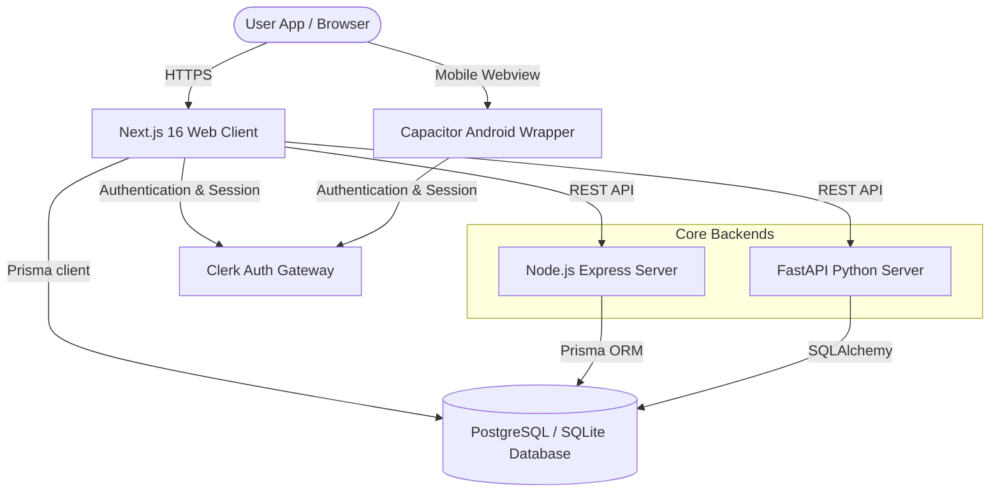
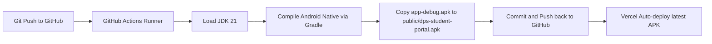

# Delhi Public School, Damanjodi
# Software Requirements Specification (SRS) for ERP System
## A Unified Cloud ERP Platform for Administrators, Teachers, Parents, and Students

---

## 1. Introduction

### 1.1 Purpose
This Software Requirements Specification (SRS) document details the complete functional, non-functional, interface, and behavioral requirements for the Delhi Public School (DPS), Damanjodi Enterprise Resource Planning (ERP) platform. This document serves as the single source of truth for administrative officers, school management, engineering teams, and testing groups. It delineates the scope, functional modules, databases, integrations, web portals, and mobile-specific workflows.

### 1.2 Document Conventions
This document matches the standard formatting rules of the **IEEE 830-1998 guidelines**. 
*   **Hierarchical Headings**: Organized hierarchically to clarify system boundaries.
*   **Boldface Terminology**: Emphasizes key user roles (e.g., **Admin**, **Teacher**, **Student**, **Parent**), state names (e.g., `APPROVED`, `PENDING`), or database entities.
*   **Monospaced Style**: Used for database tables, attributes, query schemas, and specific client/server files (e.g., [schema.prisma](file:///c:/Users/sarad/OneDrive/Desktop/dps-damanjodi-erp/prisma/schema.prisma)).

### 1.3 Intended Audience and Reading Suggestions
This specification is designed for the following stakeholders:
*   **School Management & Administrators**: Review Section 2 and Section 3 to verify functional capabilities and organizational alignments.
*   **Software Developers**: Focus on Section 3, Section 4 (Android App specifications), and Section 5 (External Interfaces) to ensure correct implementation of components.
*   **QA & Testing Engineers**: Study the detailed workflows, role guards, and non-functional specifications to design automated and manual test cases.
*   **Database Administrators**: Review Section 2.1 and Section 5.3 to analyze schemas and connection parameters.

### 1.4 Project Scope
The DPS Damanjodi ERP is a complete, multi-tenant school operations management platform. It consolidates daily timetables, user roles, classroom data, library catalogs, attendance registers, leave approvals, and exam metrics into one unified database. By introducing role-based dashboards, the platform replaces manual ledgers, isolated spreadsheets, and physical notices.

Additionally, the system provides a lightweight, dedicated **Android Application for Students**, packaged using Capacitor. The mobile app contains client-side role guards to restrict access exclusively to student logins, while parents, teachers, and admins utilize the fully responsive desktop web portal.

### 1.5 References
*   *IEEE Std 830-1998*: IEEE Recommended Practice for Software Requirements Specifications.
*   *DPS Damanjodi Database Schema*: Defined in [schema.prisma](file:///c:/Users/sarad/OneDrive/Desktop/dps-damanjodi-erp/prisma/schema.prisma).
*   *System Dependencies and Tasks*: Described in [package.json](file:///c:/Users/sarad/OneDrive/Desktop/dps-damanjodi-erp/package.json).
*   *Project Implementation Details*: Described in [PROJECT_REPORT.md](file:///c:/Users/sarad/OneDrive/Desktop/dps-damanjodi-erp/PROJECT_REPORT.md).

---

## 2. Overall Description

### 2.1 Product Perspective
The DPS Damanjodi ERP is a multi-tier client-server application consisting of a React-based Next.js web application, a Capacitor-based mobile application runtime, and API backends running on Node.js (Express) and Python (FastAPI). 

The data storage layer utilizes a central PostgreSQL database hosted on Supabase (production) and a local SQLite database for development. All database accesses are abstracted through the Prisma Object-Relational Mapper (ORM), ensuring schema compatibility across different database backends.



### 2.2 Product Functions
The platform manages core school operations through several interactive modules:
*   **Identity and Access Management**: Secure registration, login handling, OAuth integration, and permission enforcement using Clerk.
*   **Attendance Tracking**: Logging daily or subject-specific attendance by teachers, and real-time viewing by parents/students.
*   **Grade Book**: Term-based marks recording, letter grade calculations, and digital report card generation.
*   **Library Management**: Digital catalog, book checkout tracking, overdue warnings, and automatic fine calculations.
*   **Leave Application**: Leave requests for teachers, parents, and students, complete with structured review/approval states.
*   **Announcement Engine**: Bulletins targeted to all or specific roles (Academic, Event, General, Urgent notices).

### 2.3 User Classes and Characteristics
The platform enforces role-based access control (RBAC) across four distinct roles:

| User Role | Permissions & Access Scope | Operational Behavior |
| :--- | :--- | :--- |
| **System Administrator** (`ADMIN`) | Read/write permissions across all models. Administers student/teacher registers, system configuration, global announcements, and final leave approvals. | Daily, continuous usage. Access restricted to web browser. |
| **Teacher / Faculty** (`TEACHER`) | Read/write on student profiles, class attendance sheets, and academic grades. Read-only access to library catalog and announcements. | High frequency daily usage. Access restricted to web browser. |
| **Student** (`STUDENT`) | Read-only access to their own attendance percentage, report cards, issued library books, and targeted announcements. Write access to submit personal leave requests. | Periodic daily checks. Access permitted on both web and mobile app. |
| **Parent / Guardian** (`PARENT`) | Read-only access to their children's grades, attendance history, and library status. Write access to apply for leave on behalf of their child. | Weekly/intermittent usage. Access restricted to web browser. |

### 2.4 Operating Environment
*   **Web Portal**: Next.js 16 web application hosted on Vercel, compatible with Google Chrome 100+, Safari 15+, Mozilla Firefox 98+, and Microsoft Edge.
*   **Android Mobile Portal**: Native Android application packaging compiled for Android v8.0 (Oreo, API level 26) and higher.
*   **API Gateways**: Node.js v20+ and Python v3.10+ execution runtimes hosted on Render.
*   **Databases**: Local SQLite 3 (`dev.db` database file) for development and Supabase PostgreSQL 15+ for cloud production.

### 2.5 Design and Implementation Constraints
*   **Dual-Database Capability**: Schemas must map identically to PostgreSQL and SQLite via Prisma ORM. No database-specific triggers or non-standard indexes are permitted.
*   **Shared Codebase Mobile Deploy**: Capacitor must compile the Next.js static output folder (`out`) without modifying the responsive web elements.
*   **Authentication Hooks**: Users must sign in via Clerk. Custom registration screens sync Clerk profile credentials with the main Prisma DB user record.

### 2.6 Assumptions and Dependencies
*   **Clerk Uptime**: Availability of Clerk Authentication services is required. Network downtime on Clerk blocks all entry to the platform.
*   **Connection Pool Limits**: The production server relies on Supabase connection pooling to prevent database connection starvation under concurrent requests.
*   **Android WebView Engine**: The user's Android device must have an updated Android System WebView component to support ES6 and modern layout features.

---

## 3. System Features

### 3.1 User Authentication & Role Management
*   **Description**: Implements a secure sign-in, sign-up, and role registration layout. If a user is new, Clerk authentication redirects them to a `/register-role` screen where they complete their profiles by entering database-specific credentials (e.g., **Student** admission number, **Teacher** employee ID).
*   **Functional Input**: Email, password, Google OAuth tokens, database registration keys, and selected roles.
*   **Expected Output**: JSON Web Tokens (JWT) for session persistence, verified database profile record creation, and router redirect to the role-specific workspace.

### 3.2 Attendance Tracking & Reporting
*   **Description**: Allows teachers to log class or section attendance. Students and parents view live calendars reflecting daily attendance categories: Present, Absent, Late, or Half-Day.
*   **Functional Input**: Selected class, section, date, subject, and student attendance checkboxes.
*   **Expected Output**: Saved `Attendance` model entries linked to the specific student, database-driven attendance percentages, and notifications.

### 3.3 Grade Book & Academic Management
*   **Description**: Digitizes academic reporting. Teachers enter term marks (theory and practical components). The system automates grade boundary checks and marks calculations.
*   **Functional Input**: Student ID, subject, exam type (e.g., `MID_TERM`, `FINAL`), marks scored, and max marks.
*   **Expected Output**: Calculated total percentages, assigned letter grades (`A1`, `A2`, etc.), and a print-ready digital student report card.

### 3.4 Library Management System
*   **Description**: Controls book circulation. Librarians search library catalog entries, issue volumes to students, record returns, track overdue issues, and aggregate fines.
*   **Functional Input**: Student ID, barcode scans, ISBN query strings, book IDs, and return date inputs.
*   **Expected Output**: Updated database copies counter, computed due dates, warning flags for overdue loans, and calculated fine amounts.

### 3.5 Leave Application & Approval Pipeline
*   **Description**: Automates school leave processes. Users submit request details, which are routed to teachers or administrators for review.
*   **Functional Input**: Start date, end date, reason details, and status update commands (`APPROVED` or `REJECTED`).
*   **Expected Output**: Custom statuses recorded in the database, and real-time status updates visible on the applicant's dashboard.

### 3.6 Centralized Announcement Engine
*   **Description**: Disseminates announcements across the institution. Notice targets can be filtered by role.
*   **Functional Input**: Announcement title, rich text content, target audience selection, and category selection.
*   **Expected Output**: Real-time popups or alerts rendered at the top of targeted users' dashboard views.

---

## 4. Student-Only Mobile App (Capacitor Android Wrapper)

To cater to the students' mobile access requirements, the project includes an Android application wrapper. The application enforces dedicated guards to prevent non-student access, while automated cloud compile routines ensure simple build maintenance.

### 4.1 Overview & System Architecture
The mobile application is a native wrapper executing the Next.js front-end assets inside an Android WebView. The interface and network layers coordinate via the Capacitor JS bridge. To optimize student usage, the mobile client implements security filters, preventing non-student profiles from loading active modules.

### 4.2 Automatic Home Page Redirection
When the user launches the application, a custom client-side redirect component ([AndroidRedirect.jsx](file:///c:/Users/sarad/OneDrive/Desktop/dps-damanjodi-erp/src/components/AndroidRedirect.jsx)) immediately verifies if the app is executing inside the Capacitor Android native container.
*   **Identification logic**:
    ```javascript
    const isAndroidApp = (window.Capacitor && (window.Capacitor.platform === "android" || window.Capacitor.getPlatform() === "android")) ||
      window.location.search.includes("platform=android");
    ```
*   **Behavior**: If verified, the app bypasses the standard public landing page (with marketing banners, contact info, admissions details) and redirects the user directly to the `/login?platform=android` layout.

### 4.3 Mobile Registration Role Guards
In the onboarding interface (`/register-role`), registration capabilities are restricted when running inside the Android environment.
*   **Interface changes**: The selection panels for **Parent**, **Teacher**, and **Admin** profiles are hidden entirely.
*   **Registration limits**: Only the **Student** onboarding panel is visible, preventing other roles from registering database profiles through mobile devices.

### 4.4 Client-Side Portal Layout Role Guards
To prevent non-student accounts (e.g., teachers or administrators) from logging in on the mobile app, a strict layout guard is enforced in the portal shell (`/src/app/portal/layout.jsx`).
*   **Trigger point**: Fires immediately after Clerk completes authentication and retrieves the database user profile details.
*   **Validation rule**:
    ```javascript
    if (isAndroidApp && user.role !== "STUDENT") {
      alert("Mobile Access Restricted: The DPS Damanjodi Android app is exclusively for Student accounts. Please use a web browser to access your portal.");
      logout();
    }
    ```
*   **Result**: If a user logs in with a role other than `STUDENT`, the application shows an alert modal, triggers a secure logout command, clears local tokens, and redirects the user back to the login screen.

### 4.5 Automated Cloud Build and Deployment Pipeline
To compile native packages without requiring local Android SDK or Gradle installations, the application uses an automated GitHub Actions build workflow.



1.  **Trigger**: The pipeline is initiated by code pushes to the GitHub repository.
2.  **Environment**: The runner environment configures Node, Java JDK 21, and Android SDK command-line tools.
3.  **Compile Sequence**:
    *   Builds the static Next.js application (`npm run build`).
    *   Syncs front-end static files into the native Android Capacitor folder (`npx cap sync android`).
    *   Runs the native Android compilation (`./gradlew assembleDebug` in the `android/` directory).
4.  **Distribution**: The compiled APK file is copied directly to the static assets folder at `/public/dps-student-portal.apk`.
5.  **Auto-Commit**: The script commits the new APK back to the repository (using `[skip ci]` to prevent build recursion).
6.  **Direct Download**: The website navbar contains a dedicated download CTA button with an Android icon. Clicking it initiates a direct download of the latest compiled APK.

---

## 5. External Interface Requirements

### 5.1 User Interfaces
*   **Style and Layout**: Styled using Tailwind CSS v4, utilizing a forest green and gold/slate palette matching Delhi Public School's branding.
*   **Accessibility**: Implements responsive, touch-friendly layouts (minimum touch target of 44x44px for mobile devices) and matches WCAG 2.1 AA contrast standards.
*   **Charts**: Leverages Recharts libraries inside dashboard cards to visualize attendance curves, library borrow distributions, and term GPA graphs.

### 5.2 Hardware Interfaces
The system relies on standard computer and mobile network adapters. When accessing the library checkout system on mobile devices, the browser or native application requests camera permissions to scan library card QR codes or book barcodes.

### 5.3 Software Interfaces
*   **Authentication APIs**: External communication with Clerk API endpoints for session validation and security handshakes.
*   **Database Client**: Communication between the server engines and the database is facilitated by the Prisma Client library.
*   **Internal REST Endpoints**: Express (Node.js) and FastAPI (Python) backend systems communicate with the Next.js front-end using structured JSON payloads over REST.

### 5.4 Communications Interfaces
*   **Transport Security**: All network communications are secured using HTTPS (TLS 1.3 protocol).
*   **Database Security**: Connections to PostgreSQL are forced through SSL/TLS tunnels.
*   **Alert Notifications**: Automatic emails are sent via SMTP protocols when students are marked absent or library checkouts become overdue.

---

## 6. Other Nonfunctional Requirements

### 6.1 Security Requirements
*   **Password Cryptography**: All passwords stored in the database are hashed using the bcrypt algorithm.
*   **API Verification**: Protected REST API endpoints require valid Authorization headers containing Clerk session JWTs.
*   **Environment Safety**: Core credentials, database URLs, and API keys are stored in environment variables (e.g. `.env.local` or Vercel configurations) and never committed to version control.

### 6.2 Reliability & Availability Requirements
*   **Uptime target**: The cloud portal targets a 99.9% uptime rate.
*   **ACID Compliance**: Transactions are handled via PostgreSQL database engines to prevent partial writes.
*   **Backups**: Production databases on Supabase are backed up daily with a 7-day retention policy.

### 6.3 Performance Requirements
*   **Page Load Time**: Public pages and portals load in under 1.5 seconds under typical 3G/4G/5G connections.
*   **Server Response Latency**: Core database queries complete in less than 200ms.
*   **Load capacity**: Designed to handle 200+ concurrent requests, supporting high-load periods such as morning roll call registration.

### 6.4 Software Quality Attributes
*   **Maintainability**: Modularity is enforced by dividing pages into clear reusable components, separated layout files, and unified context providers (like `AuthContext`).
*   **Portability**: Capacitor handles wrapper packaging, ensuring the single Next.js source code compiles and executes consistently across browsers, tablets, and Android platforms.
*   **Usability**: Follows semantic HTML layouts (`<main>`, `<nav>`, `<header>`, `<section>`) and includes clear keyboard navigation support.

### 6.5 Business Rules
*   **Academic Entry Permissions**: Only teachers assigned to a student's class can modify grades or register daily attendance.
*   **Library Borrowing Limit**: Students are limited to a maximum of three simultaneously issued books. Fines accumulate at a rate of ₹2.00 per overdue day.
*   **Student Leave Approvals**: A student's leave request is flagged as `PENDING` until approved by their assigned class teacher.

---
